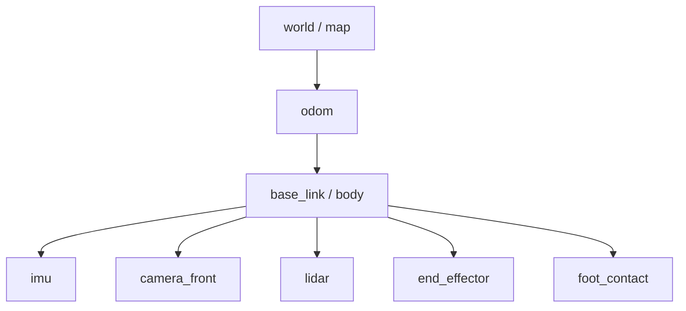
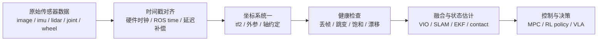
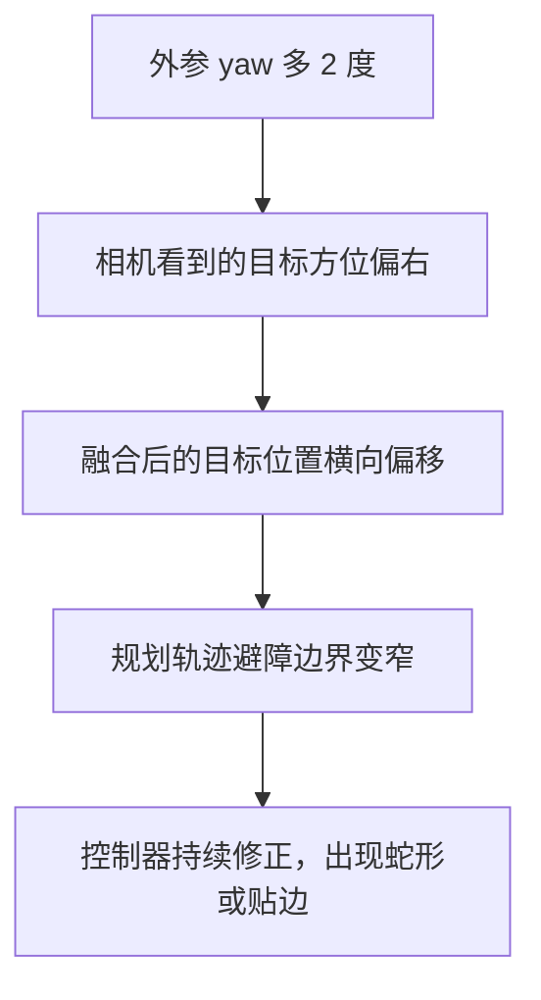
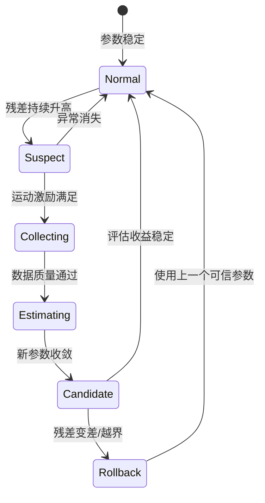

# 传感器标定与 sim2real：坐标系、时间戳与外参误差

强化学习策略、VLA 模型、MPC 控制器和 SLAM 系统都有一个共同前提：输入数据表达的是同一个时刻、同一个物理世界里的状态。如果相机外参错了 2 度，IMU 时间戳慢了 30 ms，轮速方向配置反了，算法看到的世界就会和真实机器人错开。

这就是传感器标定在具身智能里的位置：它不是某个独立工具，而是 sim2real 的地基。

---

## 1. 先把系统看成一棵坐标树

一个机器人系统里常见的坐标系包括：

- `world` / `map`：任务或地图坐标系。
- `odom`：局部连续里程计坐标系。
- `base_link` / `body`：机器人本体坐标系。
- `camera_*`：相机光心坐标系。
- `imu`：惯性测量单元坐标系。
- `lidar`：激光雷达坐标系。
- `end_effector` / `foot_*`：末端执行器或足端坐标系。



这棵树里每条边都是一个变换：

```text
T_parent_child = [R | t]
```

其中 `R` 是旋转，`t` 是平移。ROS2 的 `tf2` 会把这些边组织起来，自动计算任意两个坐标系之间的变换。

**关键点：标定不是只求一个数，而是定义“哪个坐标系相对于哪个坐标系”的关系。** 工程里最常见的错误不是求解器不够高级，而是方向写反了：你需要的是 `T_base_camera`，代码里却用了 `T_camera_base`。

---

## 2. 数据进入算法前要过三道门

传感器数据通常不是直接进模型，而是经过时间同步、坐标变换和质量检查。



这三道门分别回答：

| 问题 | 典型配置 | 错了会怎样 |
|------|----------|------------|
| 这帧数据是什么时刻的? | 时间戳、时钟源、延迟补偿 | 运动物体拖影，IMU 和图像对不上，控制滞后 |
| 这帧数据属于哪个坐标系? | `frame_id`、tf tree、外参 | 目标位置偏移，点云和图像错位，足端接触点跑偏 |
| 这帧数据可信吗? | 范围、跳变、频率、状态码 | 融合发散，控制抖动，在线标定误触发 |

---

## 3. 外参小误差会被距离放大

假设相机相对于车体或机器人本体有一个 yaw 方向误差 `delta_theta`。一个真实在正前方 `d` 米处的目标，会在横向产生近似误差：

```text
lateral_error ~= d * tan(delta_theta)
```

| 距离 d | yaw 误差 0.5 度 | yaw 误差 1 度 | yaw 误差 2 度 |
|--------|-----------------|---------------|---------------|
| 2 m    | 1.7 cm          | 3.5 cm        | 7.0 cm        |
| 5 m    | 4.4 cm          | 8.7 cm        | 17.5 cm       |
| 10 m   | 8.7 cm          | 17.5 cm       | 34.9 cm       |

这张表说明了一个很实用的判断：近距离抓取任务可能对平移误差更敏感，远距离导航和定位任务会更快暴露角度误差。



这也是为什么真机调试时不能只看“检测框准不准”。检测框准，只代表图像坐标里准；外参错时，投到 `base_link` 或 `map` 后仍然会错。

---

## 4. 时间同步错误等价于空间误差

如果机器人以速度 `v` 运动，传感器时间戳有延迟 `delta_t`，那么最基本的位置误差近似是：

```text
position_error ~= v * delta_t
```

| 速度 v | 延迟 10 ms | 延迟 30 ms | 延迟 100 ms |
|--------|------------|------------|-------------|
| 0.5 m/s | 0.5 cm | 1.5 cm | 5 cm |
| 1.0 m/s | 1 cm | 3 cm | 10 cm |
| 3.0 m/s | 3 cm | 9 cm | 30 cm |

对机械臂末端相机来说，`v` 可以是末端速度；对四足机器人来说，`v` 可以是机身速度；对轮足或移动机器人来说，`v` 可以是底盘速度。只要系统在动，时间误差就会变成空间误差。

工程上可以用三个信号快速定位时间问题：

| 信号 | 看什么 |
|------|--------|
| 频率 | 相机、IMU、轮速、关节状态是否稳定发布 |
| 单调性 | 时间戳是否回退、重复、跳变 |
| 相位差 | 加速度、角速度、轮速变化是否明显错位 |

---

## 5. 标定对象不只有相机

具身机器人常见标定对象可以按“测量什么”分组。

| 对象 | 标定内容 | 常见观测指标 |
|------|----------|--------------|
| 相机内参 | 焦距、主点、畸变 | 重投影误差、边缘直线弯曲 |
| 相机外参 | `camera` 到 `base/imu/lidar` | 图像-点云错位、目标落点偏移 |
| IMU | bias、scale、噪声、安装方向 | 静止漂移、重力方向、 Allan variance |
| 轮速 | 比例系数、左右轮差、方向 | 直线跑偏、转弯半径不一致 |
| 关节 | 零位、方向、传动比、限位 | FK 末端误差、左右腿不对称 |
| 足端/触觉 | 接触阈值、安装位置、延迟 | 支撑相误判、落足点跳变 |

这些量会互相影响。例如 IMU 安装方向错，会让姿态估计错；姿态估计错，会让相机点投到地面时错；地面目标位置错，规划和控制就会跟着错。

---

## 6. 在线标定要有触发和回退

离线标定解决“出厂或装配后参数是什么”，在线标定解决“运行中参数有没有变”。在线标定不能只看优化是否收敛，还要看它是不是在正确场景下被触发。



一个可落地的在线标定监控至少要记录：

- 触发原因：残差升高、温度变化、碰撞/震动、维修换件、长时间运行漂移。
- 数据质量：运动激励是否足够，传感器频率是否稳定，是否有时间戳异常。
- 参数变化：roll / pitch / yaw / x / y / z 相对上一次可信参数变化多少。
- 收敛状态：优化是否收敛，收敛时间是否异常。
- 回退条件：新参数是否让重投影、点云对齐、轨迹误差或控制稳定性变差。

---

## 7. 调试清单：先查低级错误

真实项目里，很多“算法效果不好”最后会落到很基础的问题。

| 优先级 | 检查项 | 快速判断 |
|--------|--------|----------|
| 1 | `frame_id` 是否正确 | RViz/tf tree 是否能连通，父子方向是否符合约定 |
| 2 | 单位是否一致 | 角度是 rad 还是 deg，长度是 m 还是 mm |
| 3 | 轴方向是否一致 | x 前 y 左 z 上，还是相机光学坐标系 |
| 4 | 时间戳是否可信 | 是否回退、重复、跳变，延迟是否补偿 |
| 5 | 静态/动态变换归属 | 固定外参不要被多个节点重复发布 |
| 6 | 参数是否匹配车型/机器人 | 相机编号、IMU 位置、轮距、关节零位是否串配置 |
| 7 | 数据是否覆盖标定所需激励 | 只直行很难估 yaw，静止数据不能估尺度 |

实践中建议把每次问题定位写成四列：

```text
现象 -> 观测信号 -> 根因假设 -> 验证动作
```

例如：

```text
点云投影到图像整体偏右
-> 近处偏差小，远处偏差大
-> camera-lidar yaw 外参偏差
-> 人工调 yaw +/- 1 度观察投影残差曲线
```

---

## 8. 一个最小练习

不用真机也可以做一个标定敏感性实验：

1. 设一个目标点 `p_base = [5, 0, 0]`，表示目标在机器人前方 5 米。
2. 构造一个 yaw 误差 `delta_theta = 1 deg`。
3. 用错误外参把点从 `base_link` 转到 `camera` 再转回来。
4. 计算恢复后的横向误差。
5. 把距离改成 2 m、10 m，观察误差如何变化。

伪代码如下：

```python
import math
import numpy as np

def rotz(theta):
    c, s = math.cos(theta), math.sin(theta)
    return np.array([[c, -s, 0], [s, c, 0], [0, 0, 1]])

for d in [2.0, 5.0, 10.0]:
    p = np.array([d, 0.0, 0.0])
    yaw_error = math.radians(1.0)
    p_wrong = rotz(yaw_error) @ p
    print(d, p_wrong[1])
```

如果你把这个练习接到真实日志上，横向误差就可以替换成重投影误差、点云配准误差、轨迹横向误差或落足点误差。教程后续可以继续把它扩展成完整的 IMU、轮速、关节和足端接触标定实验。
